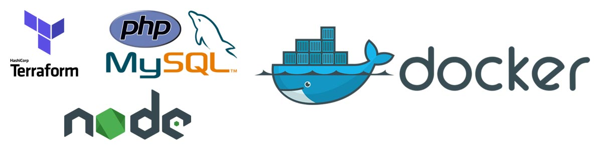

## Tinny Docker

It's my personal project. I implemented some instant Docker image and Terraform script. 
By using it users can easily to deploy their codebase from local to server with just one command.

#### What's inside this repository

- Workspace for NodeJS
- Workspace for PHP
- Nginx
- MySql
- PHPMyAdmin
- Automatically deploy on Digital Ocean with Terraform
- Centralize log with Syslog-ng

#### Folder Structure:

- config: contain env file
- deployment: contain Terraform script for automatic deployment
- environment: contain Dockerfile to initialize docker instances
- web: will contain your web sourcecode

#### Available commands (Makefile):

- Run `make up-node` to start container with NodeJS environment
- Run `make up-php` to start container with PHP environment
- Run `make build-node` to build container with NodeJS environment
- Run `make build-php` to build container with PHP environment
- Run `make down` to stop container
- Run `make db-create` to create a new table on MySQL
- Run `make terraform-validate` to check all Terraform config
- Run `make terraform-init` to install Terraform dependencies
- Run `make terraform-plan` will show execution plan
- Run `make terraform-apply` to instantiate new droplet

#### How to use PHPMyAdmin and access website on Local:

- Config `tinny-docker.local` and `admin.tinny-docker.local` on hosts
- `tinny-docker.local`: website
- `admin.tinny-docker.local`: phpmyadmin

#### Terraform Guidelines:

After git clone this repo, then replace digital ocean token and ssh key in `deployment/variable.tf`

- Run `make terraform-validate` to check all Terraform config
- Run `make terraform-init` to install Terraform dependencies
- Run `make terraform-plan` will show execution plan
- Run `make terraform-apply` to instantiate new droplet

#### Auto Deployment for Wordpress:

- Replace DB info inside /config/env.prod
- Run Terraform to trigger Digital Ocean create new Droplet

#### Reference Documents:
- https://www.syslog-ng.com/technical-documents/doc/syslog-ng-open-source-edition/3.16/administration-guide/57
